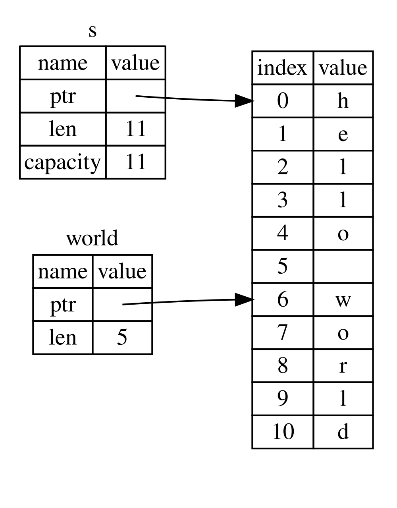

## Slice 型別

[ch04-03-slices.md](https://github.com/rust-lang/book/blob/8a6130451b0817ead5c2522ce641dcb0f11a8571/src/ch04-03-slices.md)

**切片**（*slice*）允許你引用集合中一段連續的元素序列，而不用引用整個集合。slice 是一種引用，所以它不擁有所有權。

這裡有一個程式設計小習題：編寫一個函式，接收一個由空格分隔單詞的字串，並返回它在該字串中找到的第一個單詞。如果函式在該字串中沒有找到空格，那麼整個字串就是一個單詞，因此應該返回整個字串。

> 注意：為了介紹字串 slice，本小節假設只處理 ASCII；關於 UTF-8 處理的更完整討論，請見第八章的[“使用字串儲存 UTF-8 編碼的文本”][strings]一節。

讓我們先想想，如果不用 slice，該怎樣寫這個函式的簽名，從而理解 slice 解決了什麼問題：

```rust,ignore
fn first_word(s: &String) -> ?
```

`first_word` 函式有一個 `&String` 型別的引數。因為我們不需要所有權，所以這沒有問題。不過應該返回什麼呢？我們其實沒有辦法真正表示字串的**一部分**。不過，我們可以返回單詞結尾的索引，也就是空格所在的位置。試試示例 4-7 中的程式碼。

<span class="filename">檔名：src/main.rs</span>

```rust
{{#rustdoc_include ../listings/ch04-understanding-ownership/listing-04-07/src/main.rs:here}}
```

<span class="caption">示例 4-7：`first_word` 函式返回 `String` 引數的一個位元組索引值</span>

因為我們需要逐個檢查 `String` 中的元素是否為空格，所以要用 `as_bytes` 方法把 `String` 轉換成位元組陣列。

```rust,ignore
{{#rustdoc_include ../listings/ch04-understanding-ownership/listing-04-07/src/main.rs:as_bytes}}
```

接下來，使用 `iter` 方法在位元組陣列上建立一個迭代器：

```rust,ignore
{{#rustdoc_include ../listings/ch04-understanding-ownership/listing-04-07/src/main.rs:iter}}
```

我們會在[第十三章][ch13]更詳細地討論迭代器。現在只需要知道，`iter` 方法會返回集合中的每個元素，而 `enumerate` 會包裝 `iter` 的結果，把每個元素作為元組的一部分返回。`enumerate` 返回的元組中，第一個元素是索引，第二個元素是該元素的引用。這比我們自己手動計算索引更方便一些。

因為 `enumerate` 方法返回的是元組，所以我們可以用模式來解構它；我們會在[第六章][ch6]進一步討論模式。因此，在 `for` 迴圈中，我們指定了一個模式，其中元組裡的 `i` 是索引，元組裡的 `&item` 是單個位元組。因為我們從 `.iter().enumerate()` 拿到的是元素的引用，所以模式中用了 `&`。

在 `for` 迴圈中，我們通過位元組的字面值語法來尋找代表空格的位元組。如果找到了一個空格，返回它的位置。否則，使用 `s.len()` 返回字串的長度。

```rust,ignore
{{#rustdoc_include ../listings/ch04-understanding-ownership/listing-04-07/src/main.rs:inside_for}}
```

現在有了一個找到字串中第一個單詞結尾索引的方法，不過這有一個問題。我們返回了一個獨立的 `usize`，不過它只在 `&String` 的上下文中才是一個有意義的數字。換句話說，因為它是一個與 `String` 相分離的值，無法保證將來它仍然有效。考慮一下示例 4-8 中使用了示例 4-7 中 `first_word` 函式的程式。

<span class="filename">檔名：src/main.rs</span>

```rust
{{#rustdoc_include ../listings/ch04-understanding-ownership/listing-04-08/src/main.rs:here}}
```

<span class="caption">示例 4-8：儲存 `first_word` 函式呼叫的返回值並接著改變 `String` 的內容</span>

這個程式編譯時不會報任何錯誤，而且即使在呼叫 `s.clear()` 之後再使用 `word`，也同樣不會報錯。因為 `word` 和 `s` 的狀態完全沒有關聯，所以 `word` 仍然包含值 `5`。我們可以嘗試用這個值 `5` 從變數 `s` 中提取第一個單詞，但這會出 bug，因為在把 `5` 儲存進 `word` 之後，`s` 的內容已經變了。

我們不得不時刻擔心 `word` 的索引與 `s` 中的資料不再同步，這既繁瑣又易出錯！如果編寫這麼一個 `second_word` 函式的話，管理索引這件事將更加容易出問題。它的簽名看起來像這樣：

```rust,ignore
fn second_word(s: &String) -> (usize, usize) {
```

現在我們要跟蹤一個開始索引**和**一個結束索引，同時有了更多從資料的某個特定狀態計算而來的值，但都完全沒有與這個狀態相關聯。現在有三個飄忽不定的不相關變數需要保持同步。

幸運的是，Rust 為這個問題提供了一個解決方法：字串 slice。

### 字串 slice

**字串 slice**（*string slice*）是 `String` 中一部分值的引用，它看起來像這樣：

```rust
{{#rustdoc_include ../listings/ch04-understanding-ownership/no-listing-17-slice/src/main.rs:here}}
```

不同於整個 `String` 的引用，`hello` 是一個部分 `String` 的引用，由一個額外的 `[0..5]` 部分指定。可以使用一個由中括號中的 `[starting_index..ending_index]` 指定的 range 建立一個 slice，其中 `starting_index` 是 slice 的第一個位置，`ending_index` 則是 slice 最後一個位置的後一個值。在其內部，slice 的資料結構儲存了 slice 的開始位置和長度，長度對應於 `ending_index` 減去 `starting_index` 的值。所以對於 `let world = &s[6..11];` 的情況，`world` 將是一個包含指向 `s` 索引 6 的指標和長度值 5 的 slice。

圖 4-7 給出了示意圖。



<span class="caption">圖 4-7：引用了部分 `String` 的字串 slice</span>

對於 Rust 的 `..` range 語法，如果想要從索引 0 開始，可以不寫兩個點號之前的值。換句話說，如下兩個語句是相同的：

```rust
let s = String::from("hello");

let slice = &s[0..2];
let slice = &s[..2];
```

依此類推，如果 slice 包含 `String` 的最後一個位元組，也可以捨棄尾部的數字。這意味著如下也是相同的：

```rust
let s = String::from("hello");

let len = s.len();

let slice = &s[3..len];
let slice = &s[3..];
```

也可以同時捨棄這兩個值來獲取整個字串的 slice。所以如下亦是相同的：

```rust
let s = String::from("hello");

let len = s.len();

let slice = &s[0..len];
let slice = &s[..];
```

> 注意：字串 slice range 的索引必須位於有效的 UTF-8 字元邊界內，如果嘗試從一個多位元組字元的中間位置建立字串 slice，則程式將會因錯誤而退出。

有了這些知識之後，讓我們重寫 `first_word`，讓它返回一個 slice。“字串 slice” 的型別寫作 `&str`：

<span class="filename">檔名：src/main.rs</span>

```rust
{{#rustdoc_include ../listings/ch04-understanding-ownership/no-listing-18-first-word-slice/src/main.rs:here}}
```

我們使用跟示例 4-7 相同的方式獲取單詞結尾的索引，通過尋找第一個出現的空格。當找到一個空格，我們返回一個字串 slice，它使用字串的開始和空格的索引作為開始和結束的索引。

現在呼叫 `first_word` 時，它會返回一個與底層資料繫結在一起的值。這個值由一個指向 slice 起始位置的引用和 slice 中元素的數量組成。

`second_word` 函式也可以改為返回一個 slice：

```rust,ignore
fn second_word(s: &String) -> &str {
```

現在我們有了一個更直觀、也更不容易出錯的 API，因為編譯器會確保指向 `String` 的引用始終有效。還記得示例 4-8 裡的那個 bug 嗎？我們先拿到了第一個單詞結尾的索引，然後又清空了字串，於是索引失效了。那段程式碼在邏輯上是錯的，但當時卻不會直接報錯。問題會在之後你嘗試對一個已被清空的字串繼續使用那個索引時才暴露出來。slice 讓這種 bug 不再可能發生，並且會更早告訴我們程式碼出了問題。使用 slice 版本的 `first_word` 會得到一個編譯時錯誤：

<span class="filename">檔名：src/main.rs</span>

```rust,ignore,does_not_compile
{{#rustdoc_include ../listings/ch04-understanding-ownership/no-listing-19-slice-error/src/main.rs:here}}
```

這裡是編譯錯誤：

```console
{{#include ../listings/ch04-understanding-ownership/no-listing-19-slice-error/output.txt}}
```

回憶一下借用規則，當擁有某值的不可變引用時，就不能再獲取一個可變引用。因為 `clear` 需要清空 `String`，它嘗試獲取一個可變引用。在呼叫 `clear` 之後的 `println!` 使用了 `word` 中的引用，所以這個不可變的引用在此時必須仍然有效。Rust 不允許 `clear` 中的可變引用和 `word` 中的不可變引用同時存在，因此編譯失敗。Rust 不僅使得我們的 API 簡單易用，也在編譯時就消除了一整類的錯誤！

<a id="string-literals-are-slices"></a>

#### 字串字面值就是 slice

還記得我們講到過字串字面值被儲存在二進位制檔案中嗎？現在知道 slice 了，我們就可以正確地理解字串字面值了：

```rust
let s = "Hello, world!";
```

這裡 `s` 的型別是 `&str`：它是一個指向二進位制程式特定位置的 slice。這也就是為什麼字串字面值是不可變的；`&str` 是一個不可變引用。

#### 字串 slice 作為引數

在知道了能夠獲取字面值和 `String` 的 slice 後，我們對 `first_word` 做了改進，這是它的簽名：

```rust,ignore
fn first_word(s: &String) -> &str {
```

而更有經驗的 Rustacean 會編寫出示例 4-9 中的簽名，因為它使得可以對 `&String` 值和 `&str` 值使用相同的函式：

```rust,ignore
{{#rustdoc_include ../listings/ch04-understanding-ownership/listing-04-09/src/main.rs:here}}
```

<span class="caption">示例 4-9: 通過將 `s` 引數的型別改為字串 slice 來改進 `first_word` 函式</span>

如果我們有一個字串 slice，就可以直接把它傳進去。如果我們有一個 `String`，也可以傳入整個 `String` 的 slice，或者傳入對 `String` 的引用。這種靈活性利用了 *deref coercions*，也就是我們會在[“在函式和方法中使用 Deref 強制轉換”][deref-coercions]一節中講到的特性。把函式引數定義為字串 slice，而不是 `String` 的引用，會讓我們的 API 更通用、更有用，而且不會損失任何功能：

<span class="filename">檔名：src/main.rs</span>

```rust
{{#rustdoc_include ../listings/ch04-understanding-ownership/listing-04-09/src/main.rs:usage}}
```

### 其他型別的 slice

字串 slice，正如你想像的那樣，是針對字串的。不過也有更通用的 slice 型別。考慮一下這個陣列：

```rust
let a = [1, 2, 3, 4, 5];
```

就跟我們想要獲取字串的一部分那樣，我們也會想要引用陣列的一部分。我們可以這樣做：

```rust
let a = [1, 2, 3, 4, 5];

let slice = &a[1..3];

assert_eq!(slice, &[2, 3]);
```

這個 slice 的型別是 `&[i32]`。它跟字串 slice 的工作方式一樣，通過儲存第一個集合元素的引用和一個集合總長度。你可以對其他所有集合使用這類 slice。第八章講到 vector 時會詳細討論這些集合。

## 總結

所有權、借用和 slice 這些概念讓 Rust 程式在編譯時確保記憶體安全。Rust 語言提供了跟其他系統程式語言相同的方式來控制你使用的記憶體，但擁有資料所有者在離開作用域後自動清除其資料的功能意味著你無須額外編寫和除錯相關的控制程式碼。

所有權系統影響了 Rust 中很多其他部分的工作方式，所以我們還會繼續講到這些概念，這將貫穿本書的餘下內容。讓我們開始第五章，來看看如何將多份資料組合進一個 `struct` 中。

[ch13]: ch13-02-iterators.html
[ch6]: ch06-02-match.html#繫結值的模式
[strings]: ch08-02-strings.html#使用字串儲存-utf-8-編碼的文本
[deref-coercions]: ch15-02-deref.html#在函式和方法中使用-deref-強制轉換
