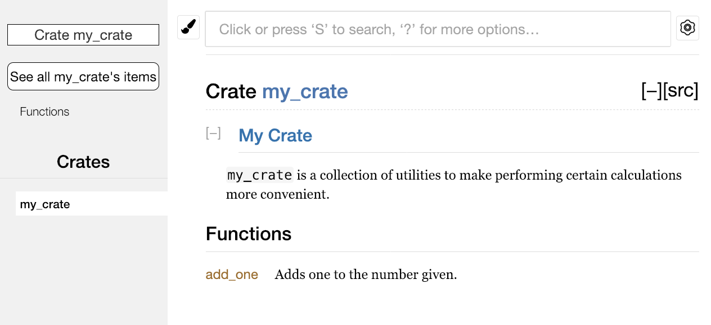

## 將 crate 釋出到 Crates.io

[ch14-02-publishing-to-crates-io.md](https://github.com/rust-lang/book/blob/43b9ad334aaf7353e5708dba49f84f941b50ec4b/src/ch14-02-publishing-to-crates-io.md)

我們曾經在專案中使用 [crates.io](https://crates.io)<!-- ignore --> 上的包作為依賴，不過你也可以透過釋出自己的包來向他人分享程式碼。[crates.io](https://crates.io)<!-- ignore --> 上的 crate 登錄檔會分發你包的原始碼，因此它主要託管開原始碼。

Rust 和 Cargo 提供了一些功能，讓你釋出的包更容易被他人找到和使用。接下來我們會介紹其中一些功能，然後說明如何釋出包。

### 編寫有用的文件註釋

準確的包文件有助於其他使用者理解如何以及何時使用它們，所以花一些時間編寫文件是值得的。第三章中我們討論瞭如何使用雙斜槓 `//` 註釋 Rust 程式碼。Rust 也有特定的用於文件的註釋型別，通常被稱為**文件註釋**（*documentation comments*），它們會生成 HTML 文件。這些 HTML 展示公有 API 文件註釋的內容，它們意在讓對庫感興趣的程式設計師理解如何**使用**這個 crate，而不是它是如何被**實現**的。

文件註釋使用三條斜槓 `///`，而不是兩條斜槓，並且支援使用 Markdown 標記來格式化文字。將文件註釋放在它所說明的項之前。示例 14-1 展示了名為 `my_crate` 的 crate 中一個 `add_one` 函式的文件註釋。

<span class="filename">檔名：src/lib.rs</span>

```rust,ignore
{{#rustdoc_include ../listings/ch14-more-about-cargo/listing-14-01/src/lib.rs}}
```

<span class="caption">示例 14-1：一個函式的文件註釋</span>

這裡，我們描述了 `add_one` 函式的功能，接著以 `Examples` 為標題開始了一個小節，並給出了展示如何使用 `add_one` 函式的程式碼。可以執行 `cargo doc` 來根據這些文件註釋生成 HTML 文件。這個命令會執行 Rust 自帶的 `rustdoc` 工具，並將生成的 HTML 文件放到 *target/doc* 目錄中。

為了方便起見，執行 `cargo doc --open` 會為當前 crate 的文件構建 HTML（以及它所有依賴的文件），並在瀏覽器中開啟結果。定位到 `add_one` 函式時，你會看到文件註釋中的文字是如何被渲染的，如圖 14-1 所示：


<span class="caption">圖 14-1：`add_one` 函式的文件註釋 HTML</span>

#### 常用章節

示例 14-1 中使用了 `# Examples` Markdown 標題在 HTML 中建立了一個以 “Examples” 為標題的部分。其他一些 crate 作者經常在文件註釋中使用的部分有：

- **Panics**：函式在什麼情況下可能會 `panic!`。不希望程式 panic 的呼叫者應確保不會在這些情況下呼叫該函式。
- **Errors**：如果函式返回 `Result`，說明可能出現哪些錯誤，以及什麼條件會導致返回這些錯誤，會有助於呼叫者編寫程式碼，以不同方式處理不同種類的錯誤。
- **Safety**：如果呼叫該函式是 `unsafe` 的（我們會在第二十章討論不安全程式碼），這裡應解釋為什麼它是不安全的，並說明函式要求呼叫者維持哪些不變式。

大多數文件註釋不需要包含所有這些章節，但這是一份很好的檢查清單，可以提醒你關注使用者會想了解的內容。

#### 文件註釋作為測試

在文件註釋中新增示例程式碼塊，有助於展示如何使用你的庫，而且還有一個額外的好處：執行 `cargo test` 時，文件中的示例程式碼也會作為測試執行！沒有什麼比帶示例的文件更好了，但也沒有什麼比示例失效的文件更糟糕了。如果我們對示例 14-1 中 `add_one` 函式的文件執行 `cargo test`，會在測試結果中看到如下內容：

```text
   Doc-tests my_crate

running 1 test
test src/lib.rs - add_one (line 5) ... ok

test result: ok. 1 passed; 0 failed; 0 ignored; 0 measured; 0 filtered out; finished in 0.27s
```

現在，如果我們修改函式或示例中的任意一方，使示例裡的 `assert_eq!` 觸發 panic，然後再次執行 `cargo test`，就會看到文件測試捕獲到了示例與程式碼不同步的問題！

#### 註釋包含項的結構

`//!` 這種文件註釋風格為“包含這些註釋的項”新增文件，而不是為“位於這些註釋之後的項”新增文件。我們通常在 crate 根檔案（按慣例是 _src/lib.rs_）或模組內部使用這種文件註釋，為整個 crate 或整個模組編寫說明。

例如，為了新增描述包含 `add_one` 函式的 `my_crate` crate 的用途的文件，我們可以在 _src/lib.rs_ 檔案開頭加入以 `//!` 開頭的文件註釋，如示例 14-2 所示：

<span class="filename">檔名：src/lib.rs</span>

```rust,ignore
{{#rustdoc_include ../listings/ch14-more-about-cargo/listing-14-02/src/lib.rs:here}}
```

<span class="caption">示例 14-2：`my_crate` crate 整體的文件</span>

注意，最後一行以 `//!` 開頭的註釋後面沒有任何程式碼。因為我們使用的是 `//!` 而不是 `///`，所以這裡記錄的是“包含這條註釋的項”的文件，而不是“緊隨這條註釋之後的項”的文件。在這裡，這個項就是 *src/lib.rs* 檔案，也就是 crate 根。這些註釋描述的是整個 crate。

執行 `cargo doc --open` 後，這些註釋會顯示在 `my_crate` 文件首頁的 crate 公有項列表上方，如圖 14-2 所示：



<span class="caption">圖 14-2：包含 `my_crate` 整體描述的註釋所渲染的文件</span>

項內部的文件註釋特別適合用來描述 crate 和模組。使用它們來解釋這個容器整體的目的，可以幫助使用者理解 crate 的組織方式。

### 匯出實用的公有 API

公有 API 的結構是你釋出 crate 時主要需要考慮的。crate 使用者沒有你那麼熟悉其結構，並且如果模組層級過大他們可能會難以找到所需的部分。

第七章介紹瞭如何使用 `pub` 關鍵字使項公開，以及如何使用 `use` 關鍵字將項引入作用域。不過，在你開發 crate 時對你來說合理的結構，對使用者而言可能並不方便。你可能想把結構體組織成一個包含多層的層級結構，但想使用你定義在深層級中的某個型別的人，可能很難發現它的存在。他們也可能會厭煩不得不寫 `use my_crate::some_module::another_module::UsefulType;`，而不是更簡單的 `use my_crate::UsefulType;`。

好訊息是，如果這種結構對外部使用者來說並不方便，你也不必重新安排內部組織。你可以使用 `pub use` 來重匯出項，從而建立一個與私有結構不同的公有結構。*重匯出（re-export）* 會把某個位置的公有項在另一個位置再次公開，就好像它原本就定義在那裡一樣。

例如，假設我們建立了一個名為 `art` 的庫，用來建模藝術概念。在這個庫裡，有兩個模組：`kinds` 模組包含兩個列舉 `PrimaryColor` 和 `SecondaryColor`，`utils` 模組包含一個名為 `mix` 的函式，如示例 14-3 所示：

<span class="filename">檔名：src/lib.rs</span>

```rust,noplayground,test_harness
{{#rustdoc_include ../listings/ch14-more-about-cargo/listing-14-03/src/lib.rs:here}}
```

<span class="caption">示例 14-3：一個庫 `art` 其組織包含 `kinds` 和 `utils` 模組</span>

圖 14-3 展示了 `cargo doc` 為這個 crate 生成的文件首頁。


<span class="caption">圖 14-3：包含 `kinds` 和 `utils` 模組的庫 `art` 的文件首頁</span>

注意 `PrimaryColor` 和 `SecondaryColor` 型別、以及 `mix` 函式都沒有在首頁中列出。我們必須點選 `kinds` 或 `utils` 才能看到它們。

依賴這個庫的另一個 crate 需要使用 `use` 語句，把 `art` 中的項引入作用域，同時必須指定當前定義的模組結構。示例 14-4 展示了一個使用 `art` crate 中 `PrimaryColor` 和 `mix` 的 crate：

<span class="filename">檔名：src/main.rs</span>

```rust,ignore
{{#rustdoc_include ../listings/ch14-more-about-cargo/listing-14-04/src/main.rs}}
```

<span class="caption">示例 14-4：一個透過匯出內部結構使用 `art` crate 中項的 crate</span>

示例 14-4 中這段程式碼的作者，必須先弄清楚 `PrimaryColor` 在 `kinds` 模組中，而 `mix` 在 `utils` 模組中。`art` crate 的模組結構，對開發 `art` crate 的人來說比對使用它的人更有意義。這種內部結構並沒有給想理解如何使用 `art` crate 的人提供有價值的資訊，反而會帶來困惑，因為使用者必須先搞清楚該去哪裡找需要的內容，還要在 `use` 語句中寫出模組名。

為了從公有 API 中去掉內部組織細節，我們可以修改示例 14-3 中的 `art` crate，加入 `pub use` 語句，在頂層重匯出這些項，如示例 14-5 所示：

<span class="filename">檔名：src/lib.rs</span>

```rust,ignore
{{#rustdoc_include ../listings/ch14-more-about-cargo/listing-14-05/src/lib.rs:here}}
```

<span class="caption">示例 14-5：增加 `pub use` 語句重匯出項</span>

現在，`cargo doc` 為這個 crate 生成的 API 文件會在首頁列出這些重匯出項及其連結，如圖 14-4 所示，這使 `PrimaryColor`、`SecondaryColor` 和 `mix` 更容易被找到。


<span class="caption">圖 14-4：列出重匯出項的 `art` 文件首頁</span>

`art` crate 的使用者仍然可以像示例 14-4 那樣看到並使用示例 14-3 中的內部結構，也可以使用示例 14-5 中更方便的結構，如示例 14-6 所示：

<span class="filename">檔名：src/main.rs</span>

```rust,ignore
{{#rustdoc_include ../listings/ch14-more-about-cargo/listing-14-06/src/main.rs:here}}
```

<span class="caption">示例 14-6：一個使用 `art` crate 中重匯出項的程式</span>

在存在很多巢狀模組的情況下，使用 `pub use` 將型別重匯出到頂層，會顯著改善使用這個 crate 的體驗。`pub use` 的另一個常見用法，是把當前 crate 的某個依賴中的定義重新匯出，讓那個 crate 的定義成為你這個 crate 公有 API 的一部分。

建立有用的公有 API 結構更像是一門藝術，而不是科學；你可以不斷迭代，找到最適合使用者的 API。選擇 `pub use` 能讓你在 crate 內部結構的組織方式上保持靈活，並將其與你呈現給使用者的結構解耦。可以看看你安裝過的一些 crate 的原始碼，觀察它們的內部結構是否和公有 API 不同。

### 建立 Crates.io 賬號

在釋出任何 crate 之前，你需要在 [crates.io](https://crates.io)<!-- ignore --> 上建立賬號並獲取一個 API token。為此，請訪問 [crates.io](https://crates.io)<!-- ignore --> 首頁，並透過 GitHub 賬號登入。（目前 GitHub 賬號仍然是必需的，不過未來這個網站可能會支援其他註冊方式。）登入之後，前往 [https://crates.io/me/](https://crates.io/me/)<!-- ignore --> 的賬戶設定頁面獲取 API key。然後執行 `cargo login` 命令，並在提示時貼上你的 API key，如下所示：

```console
$ cargo login
abcdefghijklmnopqrstuvwxyz012345
```

這個命令會把你的 API token 告訴 Cargo，並將其儲存在本地的 *~/.cargo/credentials* 檔案中。注意，這個 token 是一個**秘密**，不應該與任何人共享。如果你因為任何原因洩露了它，應立即到 [crates.io](https://crates.io)<!-- ignore --> 撤銷並重新生成一個 token。

### 向新 crate 新增元資料

比如說你已經有一個希望釋出的 crate。在釋出之前，你需要在 crate 的 *Cargo.toml* 檔案的 `[package]` 部分增加一些本 crate 的元資料（metadata）。

首先，crate 需要一個唯一的名稱。雖然在本地開發 crate 時，你可以隨意命名，但 [crates.io](https://crates.io)<!-- ignore --> 上的 crate 名稱遵循先到先得的原則。一旦某個 crate 名稱已經被佔用，就沒有其他人能再用這個名稱釋出 crate。請搜尋你想使用的名稱，確認它是否已被佔用。如果沒有，就把 _Cargo.toml_ 中 `[package]` 裡的 `name` 欄位改成你想釋出時使用的名稱，如下所示：

<span class="filename">檔名：Cargo.toml</span>

```toml
[package]
name = "guessing_game"
```

即使你選擇了一個唯一的名稱，如果此時嘗試執行 `cargo publish` 釋出該 crate 的話，會得到一個警告接著是一個錯誤：

```console
$ cargo publish
    Updating crates.io index
warning: manifest has no description, license, license-file, documentation, homepage or repository.
See https://doc.rust-lang.org/cargo/reference/manifest.html#package-metadata for more info.
--snip--
error: failed to publish to registry at https://crates.io

Caused by:
  the remote server responded with an error (status 400 Bad Request): missing or empty metadata fields: description, license. Please see https://doc.rust-lang.org/cargo/reference/manifest.html for more information on configuring these fields
```

這個錯誤是因為我們缺少一些關鍵資訊：關於該 crate 用途的描述，以及使用者可以在什麼許可條款下使用它。在 _Cargo.toml_ 中新增一兩句簡短描述即可，因為它會在搜尋結果中和你的 crate 一起顯示。對於 `license` 欄位，你需要填寫一個**許可證識別符號值**（*license identifier value*）。[Linux 基金會的 Software Package Data Exchange (SPDX)][spdx] 列出了可用的識別符號。例如，如果要指定 crate 使用 MIT License，就新增 `MIT` 識別符號：

<span class="filename">檔名：Cargo.toml</span>

```toml
[package]
name = "guessing_game"
license = "MIT"
```

如果你想使用 SPDX 中不存在的許可證，就需要把許可證文字放入一個檔案中，將該檔案包含到專案裡，然後使用 `license-file` 指定該檔名，而不是使用 `license` 欄位。

關於專案應採用何種許可證的建議超出了本書的範圍。很多 Rust 社群成員選擇與 Rust 本身相同的許可證，也就是雙許可證 `MIT OR Apache-2.0`。這個例子也說明了，你可以用 `OR` 分隔多個許可證識別符號，來為專案指定多個許可證。

那麼，有了唯一的名稱、版本號、由 `cargo new` 新建專案時增加的作者資訊、描述和所選擇的 license，已經準備好釋出的專案的 *Cargo.toml* 檔案可能看起來像這樣：

<span class="filename">檔名：Cargo.toml</span>

```toml
[package]
name = "guessing_game"
version = "0.1.0"
edition = "2024"
description = "A fun game where you guess what number the computer has chosen."
license = "MIT OR Apache-2.0"

[dependencies]
```

[Cargo 文件](https://doc.rust-lang.org/cargo/) 還描述了其他可指定的元資料，它們可以幫助你的 crate 更容易被發現和使用！

### 釋出到 Crates.io

現在，我們已經建立了賬號、儲存了 API token、為 crate 選好了名字，並填入了所需的元資料，你就可以釋出了！釋出 crate 會將該 crate 的某個特定版本上傳到 [crates.io](https://crates.io)<!-- ignore --> 供他人使用。

釋出 crate 時務必小心，因為釋出是**永久性的**。對應版本無法被覆蓋，其程式碼也無法被刪除。[crates.io](https://crates.io)<!-- ignore --> 的一個主要目標，是充當程式碼的永久歸檔伺服器，這樣所有依賴 [crates.io](https://crates.io)<!-- ignore --> 上 crate 的專案都能一直正常工作。而如果允許刪除版本，就無法實現這一目標。不過，可釋出的版本號數量並沒有限制。

再次執行 `cargo publish` 命令。這次它應該會成功：

```console
$ cargo publish
    Updating crates.io index
   Packaging guessing_game v0.1.0 (file:///projects/guessing_game)
   Verifying guessing_game v0.1.0 (file:///projects/guessing_game)
   Compiling guessing_game v0.1.0
(file:///projects/guessing_game/target/package/guessing_game-0.1.0)
    Finished `dev` profile [unoptimized + debuginfo] target(s) in 0.19s
   Uploading guessing_game v0.1.0 (file:///projects/guessing_game)
```

至此，你已經把程式碼分享給 Rust 社群了，任何人都可以輕鬆地把你的 crate 加入自己的專案依賴中。

### 釋出現有 crate 的新版本

當你修改了 crate 並準備釋出新版本時，修改 *Cargo.toml* 中 `version` 的值。請使用[語義化版本控制規則][semver]，根據修改的型別決定下一個版本號。然後再次執行 `cargo publish` 來上傳新版本。

### 使用 `cargo yank` 從 Crates.io 撤回版本

雖然你不能刪除 crate 的歷史版本，但可以阻止未來的新專案把它加入依賴。這在某個版本因為某種原因損壞時會很有用。為此，Cargo 支援對某個版本執行**撤回**（*yank*）。

**撤回**某個版本會阻止新專案依賴這個版本，不過所有已經依賴它的專案仍然可以下載並繼續依賴它。從本質上說，撤回意味著：所有已有 *Cargo.lock* 的專案都不會因此損壞，而任何新生成的 *Cargo.lock* 都不會再使用被撤回的版本。

要撤回 crate 的某個版本，請在之前釋出該 crate 的目錄中執行 `cargo yank`，並指定要撤回的版本。例如，如果我們釋出了名為 `guessing_game` 的 crate 的 `1.0.1` 版本，並想撤回它，就在 `guessing_game` 專案目錄中執行：

```console
$ cargo yank --vers 1.0.1
    Updating crates.io index
        Yank guessing_game@1.0.1
```

你也可以撤銷這次撤回，讓專案重新可以依賴該版本，只需在命令中加上 `--undo`：

```console
$ cargo yank --vers 1.0.1 --undo
    Updating crates.io index
      Unyank guessing_game@1.0.1
```

撤回**不會**刪除任何程式碼。例如，撤回功能並不能刪除你不小心上傳的秘密資訊。如果發生了這種情況，請立刻輪換這些秘密資訊。

[spdx]: https://spdx.org/licenses/
[semver]: https://semver.org/
