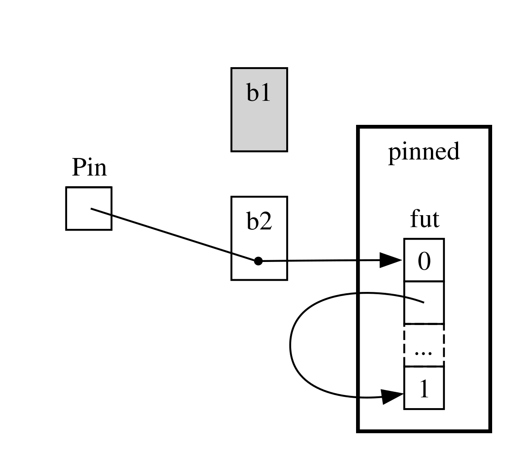

## 深入理解 async 相關的 trait

[ch17-05-traits-for-async.md](https://github.com/rust-lang/book/blob/9fc2a4e8e478ee1388c2b9ba55e3f12e89808bc2/src/ch17-05-traits-for-async.md)

貫穿本章，我們以各種方式使用了 `Future`、`Stream` 和 `StreamExt` trait。不過到目前為止，我們一直刻意沒有太深入它們究竟是如何工作的、又是如何彼此配合的。對日常 Rust 程式設計來說，這通常完全沒問題。不過有時你會遇到一些場景，在那裡你需要額外理解這些 trait 的更多細節，以及 `Pin` 型別和 `Unpin` trait。在這一節裡，我們會適度深入，足夠幫助你應對這些情況，但把*真正*深入的內容留給其他文件。

### `Future` trait

讓我們先更仔細地看看 `Future` trait 是如何工作的。Rust 中它的定義如下：

```rust
use std::pin::Pin;
use std::task::{Context, Poll};

pub trait Future {
    type Output;

    fn poll(self: Pin<&mut Self>, cx: &mut Context<'_>) -> Poll<Self::Output>;
}
```

這個 trait 定義裡包含了不少新型別，也有一些我們之前還沒見過的語法，所以我們逐部分來看。

首先，`Future` 的關聯型別 `Output` 指明瞭這個 future 最終會解析成什麼值。這和 `Iterator` trait 裡的關聯型別 `Item` 是類似的。其次，`Future` 提供了一個 `poll` 方法。它接收一個特殊的 `Pin` 包裹的 `self` 引用、一個指向 `Context` 型別的可變引用，並返回 `Poll<Self::Output>`。稍後我們會再講 `Pin` 和 `Context`。現在，先聚焦到這個方法的返回值 `Poll`：

```rust
pub enum Poll<T> {
    Ready(T),
    Pending,
}
```

這個 `Poll` 型別有點像 `Option`。它也有一個帶值的變體 `Ready(T)`，以及一個不帶值的變體 `Pending`。但 `Poll` 的語義和 `Option` 完全不同。`Pending` 表示這個 future 還有工作沒做完，因此呼叫方稍後還需要再次檢查。`Ready` 則表示這個 `Future` 已經完成，其結果值 `T` 現在已經可用。

> 注意：直接呼叫 `poll` 的場景很少，但如果你真的需要這麼做，請記住：對於大多數 future 來說，一旦它已經返回過 `Ready`，呼叫方就不應再對它呼叫 `poll`。很多 future 在 ready 之後再次被輪詢時會 panic。那些可以安全重複輪詢的 future，會在文件裡明確說明。這和 `Iterator::next` 的行為有些相似。

當你看到使用 `await` 的程式碼時，Rust 在底層會把它編譯成呼叫 `poll` 的程式碼。如果你回頭看示例 17-4，也就是在單個 URL 的標題解析完成後把它打印出來的那個例子，Rust 編譯出來的程式碼大致會像下面這樣（雖然並不完全一致）：

```rust,ignore
match page_title(url).poll() {
    Ready(page_title) => match page_title {
        Some(title) => println!("The title for {url} was {title}"),
        None => println!("{url} had no title"),
    }
    Pending => {
        // 這裡該怎麼辦？
    }
}
```

如果 future 仍然是 `Pending`，那我們該怎麼辦？我們需要一種辦法不斷重試，直到 future 最終準備好。換句話說，我們需要一個迴圈：

```rust,ignore
let mut page_title_fut = page_title(url);
loop {
    match page_title_fut.poll() {
        Ready(value) => match page_title {
            Some(title) => println!("The title for {url} was {title}"),
            None => println!("{url} had no title"),
        }
        Pending => {
            // continue
        }
    }
}
```

但如果 Rust 真按這段程式碼精確地編譯，那麼每個 `await` 就都會變成阻塞式的，這恰恰和我們想要的效果相反！Rust 實際上會保證：這個迴圈能夠把控制權交給某個東西，由它暫停當前 future 的工作，去處理別的 future，然後稍後再回來重新檢查當前這個。正如我們已經見過的，這個“某個東西”就是非同步執行時，而排程和協調這些工作，正是執行時的核心職責之一。

在[“通過訊息傳遞在兩個任務之間傳送資料”][message-passing]<!-- ignore -->一節中，我們描述過等待 `rx.recv` 的過程。`recv` 呼叫會返回一個 future，而等待這個 future 本質上就是在輪詢它。我們之前提到，執行時會暫停這個 future，直到它準備好，最終要麼得到 `Some(message)`，要麼在通道關閉時得到 `None`。現在，藉助對 `Future` trait，尤其是 `Future::poll` 的更深入理解，我們就能看清它的工作方式了：當返回 `Poll::Pending` 時，執行時知道這個 future 還沒準備好；反過來，當 `poll` 返回 `Poll::Ready(Some(message))` 或 `Poll::Ready(None)` 時，執行時就知道這個 future 已經準備好，可以繼續推進它。

至於執行時具體是怎麼做到這一點的，已經超出了本書的範圍。不過關鍵是看清 future 的基本機制：執行時會去*輪詢*它所負責的每個 future，而當 future 還沒準備好時，就讓它重新休眠。

### `Pin` 型別與 `Unpin` trait

回到示例 17-13，我們使用過 `trpl::join!` 宏來等待三個 future。不過，更常見的情況是你會有一個集合，比如一個向量，其中包含若干個 future，而這些 future 的個數要到執行時才知道。讓我們把示例 17-13 改成示例 17-23 中的程式碼：把這三個 future 放進一個向量裡，再呼叫 `trpl::join_all`。不過，這段程式碼暫時還編譯不過。

<figure class="listing">

<span class="file-name">檔名：src/main.rs</span>

```rust,ignore,does_not_compile
{{#rustdoc_include ../listings/ch17-async-await/listing-17-23/src/main.rs:here}}
```

<figcaption>示例 17-23：等待一個集合中的多個 future</figcaption>

</figure>

我們把每個 future 都放進了一個 `Box` 中，好把它們變成 *trait object*，就像我們在第十二章“從 `run` 返回錯誤”那一節做的那樣。（我們會在第十八章詳細討論 trait object。）使用 trait object 後，我們就能把這些型別各不相同的匿名 future 當成同一種類型來對待，因為它們全都實現了 `Future` trait。

這也許會讓人意外。畢竟，這些 async 程式碼塊都沒有返回任何值，所以它們每一個產生的都是 `Future<Output = ()>`。但別忘了：`Future` 是個 trait，而編譯器會為每個 async 程式碼塊生成一個獨一無二的 enum，即使它們的輸出型別完全相同。就像你不能把兩個不同的手寫 struct 放進同一個 `Vec`，你也同樣不能把這些編譯器生成的不同 enum 混在一起。

然後，我們把這組 future 傳給 `trpl::join_all`，再等待結果。然而，這段程式碼仍然無法編譯。下面是報錯中最關鍵的一部分：

```text
error[E0277]: `dyn Future<Output = ()>` cannot be unpinned
  --> src/main.rs:48:33
   |
48 |         trpl::join_all(futures).await;
   |                                 ^^^^^ the trait `Unpin` is not implemented for `dyn Future<Output = ()>`
   |
   = note: consider using the `pin!` macro
           consider using `Box::pin` if you need to access the pinned value outside of the current scope
   = note: required for `Box<dyn Future<Output = ()>>` to implement `Future`
note: required by a bound in `futures_util::future::join_all::JoinAll`
  --> file:///home/.cargo/registry/src/index.crates.io-1949cf8c6b5b557f/futures-util-0.3.30/src/future/join_all.rs:29:8
   |
27 | pub struct JoinAll<F>
   |            ------- required by a bound in this struct
28 | where
29 |     F: Future,
   |        ^^^^^^ required by this bound in `JoinAll`
```

這段錯誤資訊裡的 note 告訴我們，應該使用 `pin!` 宏來 *pin* 這些值，也就是把它們放進 `Pin` 型別中，以保證這些值不會在記憶體中移動。報錯之所以說需要 pin，是因為 `dyn Future<Output = ()>` 需要實現 `Unpin` trait，而它當前並沒有實現。

`trpl::join_all` 返回的是一個名為 `JoinAll` 的結構體。這個結構體在型別引數 `F` 上是泛型的，而 `F` 又被約束必須實現 `Future` trait。直接通過 `await` 去等待一個 future 時，Rust 會隱式地把它 pin 住。這也正是為什麼我們平常不需要在每個想等待 future 的地方都顯式寫 `pin!`。

但這裡，我們並不是直接在等待某個 future。相反，我們是通過把一組 future 傳給 `join_all`，構造出了一個新的 future：`JoinAll`。而 `join_all` 的簽名要求集合中的元素型別都必須實現 `Future` trait。另一方面，`Box<T>` 只有在它包裹的 `T` 本身是 future 且實現了 `Unpin` trait 時，才會實現 `Future`。

這一下資訊量很大！為了真正理解它，我們得再更深入一點，看清 `Future` trait 尤其是 pinning 這一部分到底是如何運作的。再看一遍 `Future` trait 的定義：

```rust
use std::pin::Pin;
use std::task::{Context, Poll};

pub trait Future {
    type Output;

    // Required method
    fn poll(self: Pin<&mut Self>, cx: &mut Context<'_>) -> Poll<Self::Output>;
}
```

這裡的 `cx` 引數以及它的 `Context` 型別，是執行時在保持 lazy 的同時，真正知道該在什麼時候重新檢查某個 future 的關鍵。和前面一樣，這部分具體機制超出了本章範圍，而且通常也只有在你自己實現 `Future` 時才需要關注。我們這裡聚焦的是 `self` 的型別，因為這是我們第一次見到一個方法裡的 `self` 帶有型別註解。對 `self` 進行型別註解，和給其他函式引數寫型別註解類似，但有兩個關鍵區別：

- 它告訴 Rust：要呼叫這個方法，`self` 必須是什麼型別。
- 它不能隨便寫成任意型別。它必須是方法所實現型別本身、該型別的引用或智慧指標，或者是一個包裹了該型別引用的 `Pin`。

我們會在[第十八章][ch-18]<!-- ignore -->裡看到更多相關語法。眼下，只要知道：如果我們想通過輪詢 future 來檢查它到底是 `Pending` 還是 `Ready(Output)`，那麼就需要一個 `Pin` 包裹的、指向該型別的可變引用。

`Pin` 是一種針對指標類型別的包裝器，比如 `&`、`&mut`、`Box` 和 `Rc`。（嚴格來說，`Pin` 作用於實現了 `Deref` 或 `DerefMut` 的型別，但實際效果基本等同於“引用和智慧指標”。）`Pin` 本身並不是指標，也不像 `Rc` 或 `Arc` 那樣自帶引用計數之類的行為；它純粹是一個讓編譯器能夠對指標使用方式施加約束的工具。

回憶一下：`await` 是通過呼叫 `poll` 實現的。理解這一點以後，前面的錯誤資訊就已經開始變得容易理解了，不過那個報錯說的是 `Unpin`，不是 `Pin`。那麼，`Pin` 和 `Unpin` 究竟是什麼關係？為什麼 `Future` 又要求 `self` 必須放在 `Pin` 裡才能呼叫 `poll` 呢？

記住，我們在本章前面提過，一個 future 裡的多個 await 點會被編譯成一個狀態機，而編譯器會確保這個狀態機遵守 Rust 關於安全性的全部常規規則，包括借用和所有權。為了做到這一點，Rust 會分析：在某個 await 點和下一個 await 點之間，或者直到 async 程式碼塊結束之前，哪些資料是需要保留的。然後，它會在編譯出來的狀態機裡生成對應的變體。每個變體都會得到其對應原始碼片段所需的資料訪問許可權，這種訪問可能是獲得所有權，也可能是獲得可變或不可變引用。

到這裡為止，一切都很好：如果你在某個 async 程式碼塊裡把所有權或引用關係寫錯了，借用檢查器會告訴你。但當我們想要移動這個程式碼塊對應的 future 時，比如把它放進 `Vec` 然後傳給 `join_all`，事情就開始變複雜了。

當我們移動一個 future 時，無論是把它放進資料結構，以便通過 `join_all` 這種方式迭代處理，還是從函數里返回它，本質上都是在移動 Rust 為我們生成的那個狀態機。與 Rust 中大多數其他型別不同的是，Rust 為 async 程式碼塊生成的 future，可能會在某個狀態變體的欄位裡儲存指向它自身其他欄位的引用，就像圖 17-4 裡的簡化示意圖那樣。

<figure>


<figcaption>圖 17-4：一個自引用的資料型別</figcaption>

</figure>

但預設情況下，任何包含自引用的物件，一旦移動就是不安全的，因為引用始終指向它們所引用物件的真實記憶體地址（見圖 17-5）。如果我們移動了這個資料結構本身，那麼這些內部引用仍然會指向舊位置。然而那個記憶體地址現在已經失效了。一方面，你之後對資料結構做的修改不會再反映到那些舊引用上；另一方面，更嚴重的是，計算機此時已經可以把那塊記憶體拿去做別的用途了。最後你很可能會讀到完全無關的資料。

<figure>


<figcaption>圖 17-5：移動自引用資料型別後產生的不安全結果</figcaption>

</figure>

理論上，Rust 編譯器也可以嘗試在物件被移動時更新所有引用，但這樣很可能帶來大量效能開銷，尤其在需要更新的是一整張引用網路的時候。如果我們反過來，確保這個資料結構*根本不在記憶體中移動*，那就完全不需要更新任何引用。這正是 Rust 借用檢查器要做的事：在安全程式碼裡，它會阻止你移動任何仍然存在活動引用的值。

`Pin` 正是在這個基礎上，進一步提供了我們需要的精確保證。當我們把一個指向某值的指標包進 `Pin` 裡，也就是對這個值進行 *pin* 之後，它就不能再被移動了。因此，如果你有的是 `Pin<Box<SomeType>>`，那麼真正被 pin 住的是 `SomeType` 這個值，而*不是* `Box` 指標本身。圖 17-6 展示了這個過程。

<figure>


<figcaption>圖 17-6：把一個指向自引用 future 型別的 `Box` pin 住</figcaption>

</figure>

實際上，`Box` 指標本身仍然可以自由移動。請記住：我們真正關心的是最終被引用的資料必須固定不動。如果指標移動了，*但它指向的資料*仍然留在原地，就像圖 17-7 那樣，那麼就不會產生問題。（你可以把這當作一個獨立練習：去查閱相關型別以及 `std::pin` 模組的文件，試著想清楚如果是 `Pin` 包著 `Box`，到底如何做到這一點。）關鍵在於：那個自引用的型別本身不能移動，因為它仍然是被 pin 住的。

<figure>



<figcaption>圖 17-7：移動一個指向自引用 future 型別的 `Box`</figcaption>

</figure>

不過，大多數型別即使碰巧放在 `Pin` 指標後面，也完全可以安全移動。只有當某個值內部真的包含引用時，我們才需要關心 pin。比如數字和布林值這類基本型別顯然沒有內部引用，所以當然是安全的。你平時在 Rust 裡處理的大多數型別也都是這樣。比如一個 `Vec` 就可以自由移動而不用擔心。考慮到目前為止我們看到的內容，如果你有一個 `Pin<Vec<String>>`，那理論上你必須通過 `Pin` 提供的那套安全但受限的 API 來操作它，哪怕 `Vec<String>` 在沒有其他引用存在時始終都是可以安全移動的。因此，我們需要一種機制來告訴編譯器：像這種情況，移動它完全沒問題。這正是 `Unpin` 的用途。

`Unpin` 是一個標記 trait（marker trait），就像我們在第十六章見過的 `Send` 和 `Sync` 一樣，它本身沒有任何功能。marker trait 的存在，只是為了告訴編譯器：實現了該 trait 的型別，在某種特定上下文裡可以被安全使用。`Unpin` 告訴編譯器，某個型別*不需要*維護“這個值是否可以安全移動”方面的額外保證。

就像 `Send` 和 `Sync` 一樣，只要編譯器能證明某個型別這樣做是安全的，它就會自動為其實現 `Unpin`。同樣也存在一個特殊情況：某個型別*不會*實現 `Unpin`。這種寫法是 <code>impl !Unpin for <em>SomeType</em></code>，其中 <code><em>SomeType</em></code> 表示的是：為了在被 `Pin` 指標引用時保持安全，該型別必須保證自身不會被移動。

換句話說，關於 `Pin` 和 `Unpin` 的關係，有兩件事要記住。第一，`Unpin` 才是“正常情況”，`!Unpin` 才是特殊情況。第二，一個型別到底實現的是 `Unpin` 還是 `!Unpin`，*只有在*你使用像 <code>Pin<&mut <em>SomeType</em>></code> 這樣指向該型別的 pin 過的指標時，才真正有意義。

為了更具體一點，想想 `String`。它內部儲存的是長度以及組成它的 Unicode 字元。我們完全可以把一個 `String` 包進 `Pin`，如圖 17-8 所示。不過，`String` 會自動實現 `Unpin`，Rust 中絕大多數其他型別也一樣。

<figure>


<figcaption>圖 17-8：把一個 `String` pin 起來；虛線表示 `String` 實現了 `Unpin` trait，因此它實際上並沒有被固定住</figcaption>

</figure>

結果就是，我們可以做一些如果 `String` 實現的是 `!Unpin` 就會非法的事情，比如像圖 17-9 那樣，在同一塊記憶體位置上把一個字串直接替換成另一個完全不同的字串。這並沒有違反 `Pin` 的約定，因為 `String` 內部沒有那種會讓它在移動時變得不安全的自引用。也正因為如此，它實現的是 `Unpin`，而不是 `!Unpin`。

<figure>


<figcaption>圖 17-9：在記憶體中用一個完全不同的 `String` 替換原來的 `String`</figcaption>

</figure>

到這裡，我們已經知道得足夠多，可以理解前面示例 17-23 中那個 `join_all` 呼叫為什麼會報錯了。我們最初試圖把 async 程式碼塊生成的 future 移動進 `Vec<Box<dyn Future<Output = ()>>>` 中，但正如我們剛剛看到的，那些 future 可能帶有內部引用，因此它們不會自動實現 `Unpin`。一旦把它們 pin 住，我們就可以放心地把得到的 `Pin` 型別放進 `Vec`，因為此時這些 future 底層的資料就*不會*再被移動。示例 17-24 展示了修復這段程式碼的方法：在定義每個 future 的地方呼叫 `pin!` 宏，並相應調整 trait object 的型別。

<figure class="listing">

<span class="file-name">檔名：src/main.rs</span>

```rust
{{#rustdoc_include ../listings/ch17-async-await/listing-17-24/src/main.rs:here}}
```

<figcaption>示例 17-24：將 future pin 住，以便把它們移動進向量中</figcaption>

</figure>

這段程式碼現在已經可以編譯和運行了，而且我們還能在執行時動態地從向量裡增加或刪除 future，再把它們全部 join 在一起。

### `Stream` trait

現在你已經對 `Future`、`Pin` 和 `Unpin` 有了更深入的理解，我們可以把注意力轉向 `Stream` trait 了。正如你在本章前面學到的，stream 很像非同步迭代器。不過和 `Iterator` 以及 `Future` 不同的是，到本書寫作時，標準庫裡還沒有 `Stream` 的定義；但 `futures` crate 提供了一個在整個生態系統中被廣泛採用的通用定義。

在看 `Stream` 如何把 `Iterator` 和 `Future` 的特徵結合起來之前，我們先回顧一下這兩個 trait 的定義。從 `Iterator` 我們得到了“序列”這個概念：它的 `next` 方法返回 `Option<Self::Item>`。從 `Future` 我們得到了“值會隨著時間變得就緒”這個概念：它的 `poll` 方法返回 `Poll<Self::Output>`。為了表示“一串會隨著時間逐漸就緒的項”，我們就可以定義這樣一個 `Stream` trait，把兩者的特徵合併起來：

```rust
use std::pin::Pin;
use std::task::{Context, Poll};

trait Stream {
    type Item;

    fn poll_next(
        self: Pin<&mut Self>,
        cx: &mut Context<'_>
    ) -> Poll<Option<Self::Item>>;
}
```

`Stream` trait 定義了一個名為 `Item` 的關聯型別，用來表示 stream 產生的條目型別。這和 `Iterator` 很像，因為它可以有零個到多個條目；而和 `Future` 不同，後者始終只有一個 `Output`，哪怕這個輸出只是 unit 型別 `()`。

`Stream` 還定義了一個獲取這些條目的方法。它叫 `poll_next`，這個名字清楚地表明：它既像 `Future::poll` 那樣進行輪詢，又像 `Iterator::next` 那樣生成一個接一個的條目。它的返回型別把 `Poll` 和 `Option` 組合了起來。最外層是 `Poll`，因為和 future 一樣，它需要先檢查是否就緒；裡面那層是 `Option`，因為和迭代器一樣，它還得表示“後面是否還有更多條目”。

和這個定義非常相似的版本，將來很可能會進入 Rust 標準庫。在此之前，它已經是大多數執行時工具箱的一部分，因此你完全可以依賴它，而我們接下來講的內容通常也都會成立。

不過，在我們前面[“Stream：按順序出現的 Future”][streams]<!-- ignore -->一節中見到的那些例子裡，我們並沒有直接用 `poll_next` 或 `Stream`，而是用了 `next` 和 `StreamExt`。當然，我們*可以*像直接操作 future 的 `poll` 方法那樣，手寫自己的 `Stream` 狀態機，直接基於 `poll_next` 來工作。不過，用 `await` 顯然舒服得多，而 `StreamExt` trait 則為此提供了 `next` 方法：

```rust
{{#rustdoc_include ../listings/ch17-async-await/no-listing-stream-ext/src/lib.rs:here}}
```

> 注意：我們在本章前面實際使用到的定義，看起來會和這個稍微有點不同，因為它需要相容那些還不支援“在 trait 中使用 async 函式”的 Rust 版本。所以它實際上更像這樣：
>
> ```rust,ignore
> fn next(&mut self) -> Next<'_, Self> where Self: Unpin;
> ```
>
> 這裡的 `Next` 型別是一個實現了 `Future` 的 `struct`，它通過 `Next<'_, Self>` 的形式，把對 `self` 的引用生命週期顯式命名出來，這樣 `await` 才能和這個方法一起工作。

`StreamExt` trait 還是所有那些“用於 stream 的有趣方法”的所在地。任何實現了 `Stream` 的型別，都會自動獲得 `StreamExt` 的實現；不過這兩個 trait 之所以分開定義，是為了讓社群能夠在不影響底層基礎 trait 的前提下，不斷迭代那些更方便的高層 API。

在 `trpl` crate 使用的這個 `StreamExt` 版本里，這個 trait 不僅定義了 `next` 方法，還給 `next` 提供了一個預設實現，這個實現會正確處理 `Stream::poll_next` 的各種細節。這意味著，即便你將來需要自己寫一種流式資料型別，也*只需要*實現 `Stream`；然後，任何使用你這個資料型別的人，都會自動獲得 `StreamExt` 及其方法。

關於這些 trait 的底層細節，我們就講到這裡。最後，讓我們來想一想：future（包括 stream）、任務和執行緒到底是如何一起協作的。

[message-passing]: ch17-02-concurrency-with-async.html#通過訊息傳遞在兩個任務之間傳送資料
[ch-18]: ch18-00-oop.html
[async-book]: https://rust-lang.github.io/async-book/
[under-the-hood]: https://rust-lang.github.io/async-book/02_execution/01_chapter.html
[pinning]: https://rust-lang.github.io/async-book/04_pinning/01_chapter.html
[first-async]: ch17-01-futures-and-syntax.html#第一個非同步程式
[any-number-futures]: ch17-03-more-futures.html#使用任意數量的-futures
